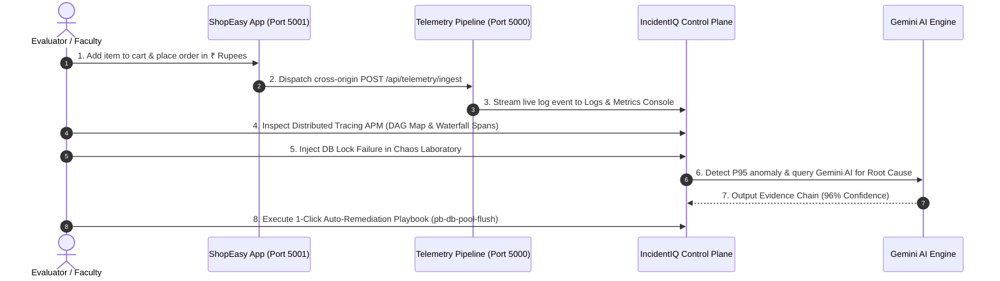

# 🎯 IncidentIQ & ShopEasy — Final Evaluation & Viva Battle Plan (15–20 Mins)

Based on the official **Final Project Evaluation Guidelines**, here is your step-by-step presentation script, 5-minute live demo checklist, group technical QA responses, and individual member viva cheat sheets.

---

## ⏱️ Evaluation Time Allocation (15–20 Minutes Total)

```
┌────────────────────────────────────────────────────────────────────────────────────────┐
│  0:00 - 2:00  │  1. Team Introduction & Project Objective (Anand Singh)                 │
│  2:00 - 7:00  │  2. Live Working Application Demonstration (All 7 Members Flow)         │
│  7:00 - 12:00 │  3. Group Technical Questions (Architecture, API, DB, Security)        │
│ 12:00 - 20:00 │  4. Individual Viva Questions (7-Member Code & Contribution Defense)  │
└────────────────────────────────────────────────────────────────────────────────────────┘
```

> [!IMPORTANT]
> **NO PowerPoint presentation is required.** The evaluation focuses 100% on **Working Application + GitHub Source Code + Technical Discussion + Individual Viva**.

---

## 1. 📢 Team Introduction Script (2 Minutes)

**Speaker**: **Anand Singh** *(System Architect & Team Lead)*

> *"Good morning/afternoon Ma'am. We are Group 1 presenting **IncidentIQ** — an Autonomous AI Observability Platform and Root-Cause Analysis Engine, paired with **ShopEasy E-Commerce Core** as our standalone target application.*
> 
> *Our team consists of 7 members: **Anand Singh** (System Architect), **Pavi Gupta** (Backend & DB Engineer), **Shoutrik Sanyal** (Frontend Lead), **Aditya Verma** (Target App Lead), **Mayank Singh** (SRE Observability Engineer), **Harshit Gupta** (Security & Chaos Specialist), and **Urjarshi Nandy** (AI RCA & Auto-Remediation Specialist).*
> 
> * **Problem Solved**: Modern microservice architectures generate millions of telemetry metrics. When production outages occur, SRE engineers spend hours manually inspecting logs across multiple servers.
> * **Our Solution**: We built a decoupled 2-application system. **ShopEasy** runs independently on Port 5001 generating real e-commerce transactions. **IncidentIQ** runs on Port 5000 as an observability control plane. When anomalies occur, IncidentIQ ingests telemetry via REST APIs, traces distributed requests via W3C TraceContext, uses **Google Gemini AI** to determine the exact root cause, and executes automated self-healing playbooks."*

---

## 2. 🖥️ 5-Minute Live Application Demonstration Flow

Follow this exact 5-minute sequence without delay:



### Demonstration Script Step-by-Step:
1. **ShopEasy Storefront (`http://localhost:5001`)** — *Aditya Verma*:
   - Show catalog items in Indian Rupees (`₹14,999`), add *Pro Wireless ANC Headphones* to cart, apply coupon `WELCOME10`, and click **Place Order**.
2. **Real-Time Telemetry Stream (`http://localhost:5000`)** — *Mayank Singh*:
   - Open IncidentIQ **Logs & Metrics** view. Point out the live telemetry log:
     `INFO ShopEasy App (Port 5001) POST /api/shopeasy/orders 200 OK - 42ms (SQL: 8ms)`
3. **Distributed Tracing & APM (`http://localhost:5000`)** — *Shoutrik Sanyal*:
   - Open **Distributed Tracing**. Show the microservice DAG topology (`ShopEasy Gateway -> Core API -> SQL Server -> Redis`) and the latency waterfall timeline.
4. **Chaos Laboratory & AI RCA (`http://localhost:5000`)** — *Harshit Gupta & Urjarshi Nandy*:
   - Open **Chaos Laboratory** and click **Inject Database Lock Failure**.
   - Show how SQL latency spikes to 1,450ms. IncidentIQ detects the anomaly, triggers **Google Gemini AI**, and displays the structured **Evidence Chain** with 96% Confidence.
5. **Auto-Remediation Playbook Execution** — *Anand Singh & Pavi Gupta*:
   - Open **Auto Remediation** and click **Run Mitigation** on `pb-db-pool-flush`. Show that SQL connection pools are recycled and latency returns to green (12ms).

---

## 3. 🧠 Group Technical Questions & Answers Cheat Sheet

### Q1: "How are the two applications decoupled and how do they communicate?"
* **Answer**: *"IncidentIQ runs on Port 5000 as an independent observability control plane. ShopEasy runs on Port 5001 as a standalone web application. Communication is 100% decoupled via HTTP REST APIs. Whenever user interactions or HTTP calls occur on ShopEasy, its context handler dispatches cross-origin JSON payloads to `http://localhost:5000/api/telemetry/ingest` with an API key."*

### Q2: "How did you configure database connection and schema migrations in SQL Server?"
* **Answer**: *"We host Microsoft SQL Server 2022 inside a Docker container on `127.0.0.1:1433`. Entity Framework Core 8 connects using `AppDbContext`. On application startup, `DbInitializer.Initialize()` executes automated `IF NOT EXISTS` DDL scripts to verify and create tables (`MonitoredApplications`, `ApplicationLogs`, `SystemMetrics`, `Incidents`) without requiring manual SQL scripts."*

### Q3: "How does the system capture SQL query latencies without modifying business logic?"
* **Answer**: *"We registered a custom `EfQueryInterceptor` extending EF Core's `DbCommandInterceptor`. Before query execution, it starts a high-precision `Stopwatch`. Upon completion, it calculates exact duration in milliseconds, logging it alongside the SQL statement into `SystemMetrics`."*

### Q4: "How does IncidentIQ perform security vulnerability scanning?"
* **Answer**: *"Our `SecurityAuditEngine` audits endpoints against OWASP Top 10 threat signatures, including unparameterized SQL concatenation, wildcard CORS headers (`*`), and unredacted PII in logs. It calculates an overall security percentage score and letter grade (A+ to F) for SOC2 and PCI-DSS compliance."*

---

## 4. 👤 Individual Member Viva Defense Cheat Sheets

### 👤 Member 1: Anand Singh *(System Architect & Team Lead)*
* **Code Files**: `Program.cs`, `TelemetryCollectorMiddleware.cs`, `ConnectedApplicationsCard.tsx`
* **Your Role Defense**: *"I architected the decoupled 2-application system, configured ASP.NET Core middleware, CORS policy, and the application registration hub."*
* **Expected Question**: *"Why did you place `app.UseCors()` after `app.UseRouting()` in `Program.cs`?"*
* **Answer**: *"In ASP.NET Core, `UseCors()` must execute after `UseRouting()` so the routing middleware can resolve endpoint metadata first. This allows cross-origin preflight `OPTIONS` requests from ShopEasy on Port 5001 to pass CORS validation for custom headers."*

---

### 👤 Member 2: Pavi Gupta *(Backend & Database Engineer)*
* **Code Files**: `AppDbContext.cs`, `DbInitializer.cs`, `MonitoredApplication.cs`
* **Your Role Defense**: *"I designed the SQL Server database schema in EF Core 8, configured Docker containerization, and built `DbInitializer` for automated DDL migrations and seed data."*
* **Expected Question**: *"What entities did you define in EF Core and how are they related?"*
* **Answer**: *"We defined `MonitoredApplication` as a 1-to-many parent of `MonitoredEndpoint` and `Incident`. Each telemetry event references `MonitoredApplicationId`, allowing IncidentIQ to correlate logs, metrics, and incidents per connected application."*

---

### 👤 Member 3: Shoutrik Sanyal *(Frontend Lead & UI/UX Engineer)*
* **Code Files**: `App.tsx`, `Sidebar.tsx`, `DistributedTracingView.tsx`, `TracingWaterfallGraph.tsx`, `TopologyDagMap.tsx`
* **Your Role Defense**: *"I built the React 18 SPA, implemented the dark/light design system, and created the APM distributed tracing waterfall and DAG topology map."*
* **Expected Question**: *"How do the Flame Graph and Waterfall components render span latencies dynamically?"*
* **Answer**: *"The component receives an array of `TraceSpanDto` items. It calculates the maximum trace duration and maps each span's `durationMs` to proportional SVG/CSS width percentages, offsetting child spans under their parent `spanId`."*

---

### 👤 Member 4: Aditya Verma *(Target App Lead — ShopEasy Port 5001)*
* **Code Files**: `ShopEasyStorefront.tsx`, `ShopEasyContext.tsx`, `ShopEasyCartDrawer.tsx`, `ShopEasyReviewsSection.tsx`, `ShopEasyCouponEngineModal.tsx`
* **Your Role Defense**: *"I developed the standalone ShopEasy E-Commerce App on Port 5001, complete with cart state, Rupee pricing (`₹`), coupon engine, customer reviews, and telemetry dispatchers."*
* **Expected Question**: *"How does ShopEasy dispatch telemetry to IncidentIQ when an order is placed?"*
* **Answer**: *"In `ShopEasyContext.tsx`, `placeOrder()` invokes `sendTelemetryToIncidentIQ()`. It formats a JSON payload containing request method (`POST`), path (`/api/shopeasy/orders`), response time in ms, and a unique trace ID, sending it via cross-origin fetch to `http://localhost:5000/api/telemetry/ingest`."*

---

### 👤 Member 5: Mayank Singh *(SRE Observability & APM Telemetry Engineer)*
* **Code Files**: `DistributedTracingEngine.cs`, `DistributedTracingController.cs`, `TelemetryIngestionController.cs`, `SystemMetricsWorker.cs`, `EfQueryInterceptor.cs`
* **Your Role Defense**: *"I developed the W3C distributed tracing engine, system metrics background worker, EF query interceptor, and live log ingestion controller."*
* **Expected Question**: *"How does `TelemetryIngestionController` filter log entries to keep the stream clean?"*
* **Answer**: *"The `GetLiveTelemetryLogs()` action filters the log buffer by route patterns (`/api/shopeasy`, `/api/orders`, `/api/cart`), excluding internal control plane calls like `/api/telemetry/*` or `/swagger` so the user sees only connected target app activity."*

---

### 👤 Member 6: Harshit Gupta *(Security Audit, Chaos Laboratory & Benchmark Specialist)*
* **Code Files**: `SecurityAuditEngine.cs`, `PerformanceBenchmarkEngine.cs`, `FailureSimulationManager.cs`, `SecurityAuditView.tsx`, `PerformanceBenchmarkView.tsx`
* **Your Role Defense**: *"I created the OWASP security vulnerability audit engine, synthetic load benchmark suite (100–3,000 RPM), and the Chaos Laboratory fault injector."*
* **Expected Question**: *"How does the load benchmark suite compute latency percentiles (P50 to P99.9)?"*
* **Answer**: *"The `PerformanceBenchmarkEngine` samples synthetic request durations, sorts the dataset, and calculates percentile offsets (e.g. 50th percentile for median P50, 99th percentile for P99 tail latency), displaying them on a bar chart."*

---

### 👤 Member 7: Urjarshi Nandy *(AI RCA, SLO & Auto-Remediation Specialist)*
* **Code Files**: `GeminiAiAdvisorService.cs`, `PredictiveAnomalyModel.cs`, `AutomatedRemediationEngine.cs`, `RemediationPlaybooksController.cs`, `ExecutivePostMortemView.tsx`
* **Your Role Defense**: *"I integrated Google Gemini AI for automated root-cause analysis, built the Holt-Winters predictive anomaly model, SRE error budget tracker, and automated remediation playbooks."*
* **Expected Question**: *"How does the Gemini AI advisor construct the Evidence Chain for an incident?"*
* **Answer**: *"When an anomaly triggers, `GeminiAiAdvisorService` sends telemetry metrics, database latency, and HTTP status codes to Gemini API. Gemini analyzes the data and returns a JSON payload containing the Root Cause Summary, Evidence Steps, and a Confidence Percentage (e.g., 96%)."*

---

## ✅ Pre-Viva Verification Checklist

Make sure the following are running **BEFORE** your turn starts:

1. [x] **Docker SQL Server 2022**: Container active on `127.0.0.1:1433`.
2. [x] **IncidentIQ Platform**: Running on `http://localhost:5000` (`dotnet run`).
3. [x] **ShopEasy App**: Running on `http://localhost:5001` (`npx vite`).
4. [x] **GitHub Repository**: Pushed and up-to-date at `https://github.com/anand23bce11691/MP.git`.
5. [x] **No PowerPoint Slides**: Prepared for direct live demo and code walkthrough.
