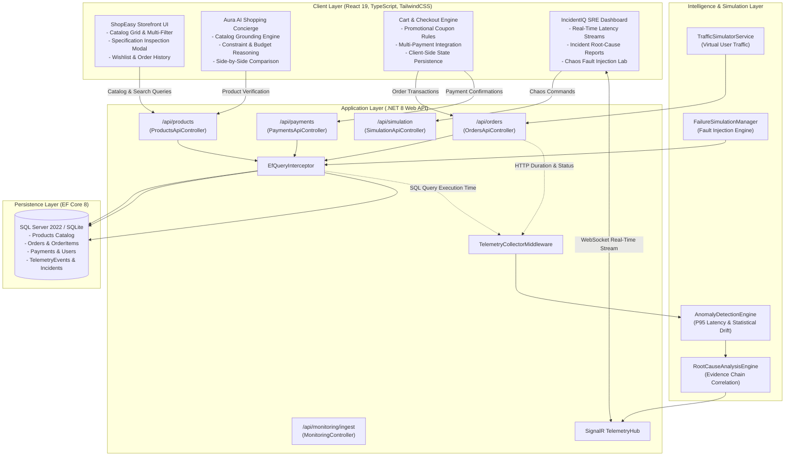
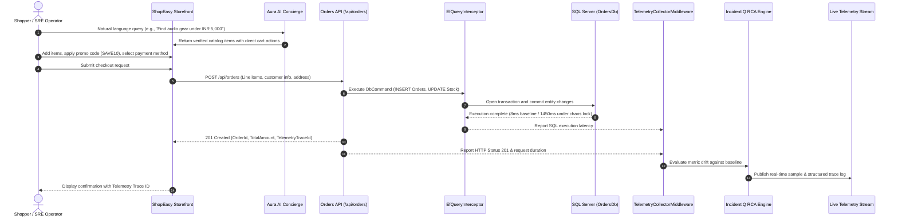
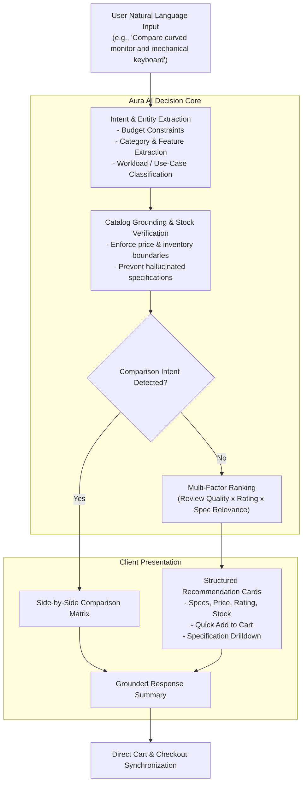

# IncidentIQ Platform & ShopEasy E-Commerce Core

IncidentIQ is an autonomous AI-driven observability and root-cause analysis (RCA) platform integrated with a high-throughput target commercial microservice (**ShopEasy E-Commerce Core**) and a grounded conversational shopping assistant (**Aura AI**).

---

## Architecture Overview



---

## Transaction & Telemetry Execution Flow



---

## Conversational Commerce Decision Engine



---

## System Capabilities

### 1. ShopEasy E-Commerce Core
- **Curated Product Catalog:** Categorized inventory covering Audio, Peripherals, Displays, Wearables, Storage, Video, Accessories, Furniture, and Smart Home with high-resolution imagery and verified technical specifications.
- **Specification Drilldown Modal:** Detailed technical sheets, warranty badges, verified user review distributions, and instant purchase flows.
- **Wishlist Management:** Persistent client-side favorites management with one-click batch migration to active cart sessions.
- **Promotional Discount Engine:** Real-time discount calculations supporting promotional rules (`SAVE10`, `TECH20`, `FREESHIP`).
- **Multi-Method Checkout:** Support for Credit/Debit Cards, UPI / QR payments, Net Banking, and Cash on Delivery (COD) with automated GST calculation.
- **Order Tracking & Telemetry Link:** Post-purchase tracking connected directly to backend trace IDs for full observability correlation.

### 2. Aura AI Shopping Concierge
- **Strict Catalog Grounding:** Recommendations are constrained to real database records to prevent hallucination of pricing, specifications, or availability.
- **Constraint Resolution:** Automatic extraction and enforcement of budget limits, hardware categories, and use cases.
- **Comparative Analysis:** Structured side-by-side technical evaluation across catalog items.
- **Interactive UI Integration:** Direct cart addition and specification modal triggers from within the conversational interface.

### 3. IncidentIQ SRE Observability Platform
- **Telemetry Ingestion:** High-throughput telemetry collector supporting push telemetry (`POST /api/monitoring/ingest`) and EF Core middleware interception.
- **Chaos Laboratory:** Deterministic failure injection including database connection pool exhaustion, payment gateway outages (HTTP 500), traffic surges, and cascading multi-service failures.
- **Root-Cause Analysis Engine:** Statistical anomaly evaluation with confidence scoring, evidence chains, and suggested remediation procedures.

---

## Local Development and Deployment

### Prerequisites
- Node.js (v18 or higher) and npm
- .NET 8 SDK (for backend execution)

### 1. Frontend Setup (Development Server)
```bash
cd frontend
npm install
npm run dev
```
Access the application at `http://localhost:5173`.

### 2. Frontend Production Build
```bash
cd frontend
npm run build
```
Builds the optimized production client bundle directly into `src/IncidentIQ.WebApi/wwwroot`.

### 3. Backend Execution (.NET Web API)
```powershell
dotnet run --project .\src\IncidentIQ.WebApi
```
The database model and default catalog are seeded automatically on first run.

### 4. Docker Deployment
```powershell
docker compose up --build
```
Access the containerized application at `http://localhost:8080`.

---

## API Specification

| HTTP Method | Route | Description |
| :--- | :--- | :--- |
| `GET` | `/api/products` | Retrieve catalog items with filtering (`category`, `search`, `sort`, `minPrice`, `maxPrice`) |
| `GET` | `/api/products/{id}` | Retrieve individual product details and technical specifications |
| `POST` | `/api/products` | Create a new catalog product |
| `POST` | `/api/orders` | Submit customer order, decrement stock, and record telemetry |
| `GET` | `/api/orders` | Retrieve recent orders with associated line items and status |
| `GET` | `/api/orders/{id}` | Retrieve specific order details by ID |
| `POST` | `/api/payments` | Process virtual transaction settlement for an existing order |
| `POST` | `/api/monitoring/ingest` | Ingest external application telemetry events |
| `GET` | `/api/simulation/state` | Retrieve active chaos simulation states |
| `POST` | `/api/simulation/command` | Execute chaos fault injection or reset baselines |
