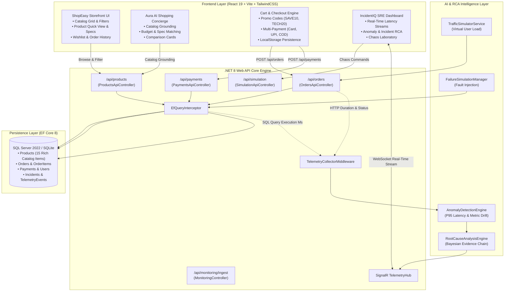
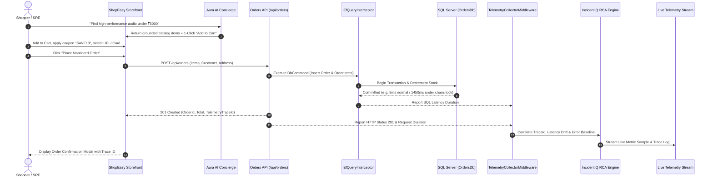
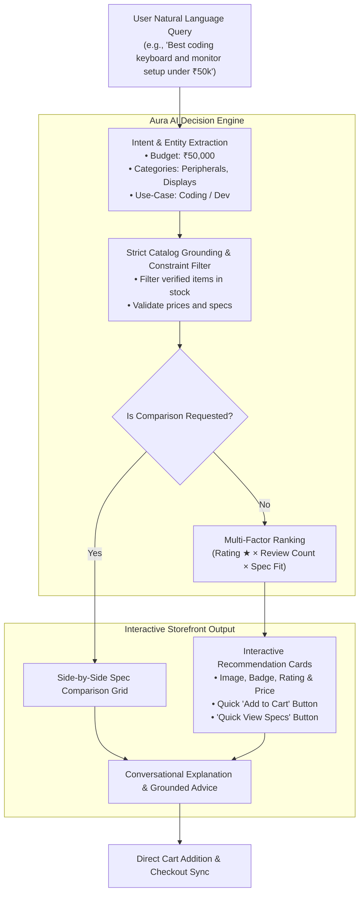

# IncidentIQ Platform & ShopEasy E-Commerce Core

> **IncidentIQ** is an autonomous AI observability and root-cause analysis (RCA) platform coupled with a high-throughput target e-commerce microservice (**ShopEasy E-Commerce Core**) and an intelligent conversational shopping concierge (**Aura AI**).

---

## 🏗️ System Architecture



---

## ⚡ E-Commerce Order Placement & Telemetry Pipeline



---

## 🤖 Aura AI Conversational Shopping Flow



---

## ✨ Features Breakdown

### 🛍️ ShopEasy E-Commerce Core
- **Curated 15-Product Tech Catalog:** High-resolution photography, categorized under *Audio, Peripherals, Displays, Wearables, Storage, Video, Accessories, Furniture, and Smart Home*.
- **Technical Specification Drilldown:** In-depth product modal with technical specs tables, warranty badges, verified reviews, and instant "Buy Now" flow.
- **Persistent Wishlist:** One-click favorite toggling saved to browser storage, with easy "Move to Cart" drawer actions.
- **Promo & Coupon Engine:** Instant discount calculation supporting `SAVE10` (10% off), `TECH20` (20% off > ₹10,000), and `FREESHIP`.
- **Flexible Checkout:** Multi-payment options including Credit/Debit Card, UPI / QR Code, Net Banking, and Cash on Delivery (COD) with itemized GST breakdown.
- **Order History & Telemetry Link:** Tracks previous orders with live status badges and direct links to inspect the associated transaction's SQL query and HTTP latency traces.

### 🧠 Aura AI Shopping Concierge
- **Strict Catalog Grounding:** Answers customer queries strictly from real catalog data without inventing non-existent models, fake stock, or hallucinated prices.
- **Natural Language & Budget Parsing:** Extracts price thresholds (e.g. *"under 5k"*, *"below ₹15,000"*), target categories, and use cases (*"gaming"*, *"podcasting"*, *"remote work"*).
- **Side-by-Side Comparison:** Compares specifications, ratings, and price-to-performance metrics between products.
- **1-Click Cart Addition:** Directly adds recommended product bundles into the shopping cart from within the chat interface.

### 📈 IncidentIQ SRE Observability Platform
- **Dual Telemetry Ingestion:** Supports push telemetry (`POST /api/monitoring/ingest`) and real-time middleware interception.
- **Chaos Laboratory:** Inject synthetic failure modes (Database Lock & Slowdown, HTTP 500 Payment Outage, Traffic Surge Threadpool Saturation, Cascading Failures).
- **Automated Root-Cause Diagnosis:** Correlates time-series anomaly sequences to diagnose root causes with percentage confidence scores and suggested remediation plans.

---

## 🚀 Getting Started Locally

### Prerequisites
- [Node.js](https://nodejs.org/) (v18+) & [npm](https://www.npmjs.com/)
- [.NET 8 SDK](https://dotnet.microsoft.com/download/dotnet/8.0) (optional for backend API execution)

### 1. Run Frontend Dev Server
```bash
cd frontend
npm install
npm run dev
```
Open `http://localhost:5173` in your browser.

### 2. Build Frontend for Production (Bundles into WebApi wwwroot)
```bash
cd frontend
npm run build
```

### 3. Run Backend .NET Web API
```powershell
dotnet run --project .\src\IncidentIQ.WebApi
```
The SQLite database (`incidentiq-platform.db`) is automatically initialized and seeded with the rich product catalog and monitoring endpoints.

### 4. Docker / SQL Server Deployment
```powershell
docker compose up --build
```
Access the application at `http://localhost:8080`.

---

## 📡 REST API Reference

| Method | Endpoint | Description |
| :--- | :--- | :--- |
| `GET` | `/api/products` | Query catalog items with `?category=`, `?search=`, `?sort=`, and `?minPrice=` |
| `GET` | `/api/products/{id}` | Get product details by ID |
| `POST` | `/api/orders` | Place a new order, deduct stock, and emit telemetry |
| `GET` | `/api/orders` | Retrieve recent orders with full line item details |
| `POST` | `/api/payments` | Process virtual payment settlement for an order |
| `POST` | `/api/monitoring/ingest` | Ingest external application telemetry events |
| `GET` | `/api/simulation/state` | Inspect current chaos failure simulation status |
| `POST` | `/api/simulation/command` | Inject or reset chaos failure states |
