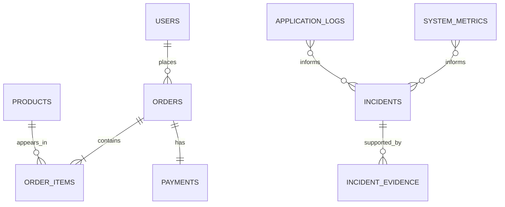

# IncidentIQ Database Design

## Design choices

The schema has three bounded areas:

- **ShopEasy business data** is normalized to avoid duplicated users, products and order values.
- **Telemetry data** is flat and time-oriented because it is written frequently and queried in short recent windows.
- **Incident data** retains the diagnosis and ordered evidence that supports it, independently of any external AI service.



## Tables

| Table | Primary key | Key relationships | Purpose |
|---|---|---|---|
| `Users` | `UserId` | One user has many orders | ShopEasy customer identity |
| `Products` | `ProductId` | Referenced by order items | Catalogue |
| `Orders` | `OrderId` | User, order items, one payment | Sales transaction header |
| `OrderItems` | `OrderItemId` | Order and product | Resolves orders/products many-to-many |
| `Payments` | `PaymentId` | Exactly one payment per order | Payment outcome |
| `SystemMetrics` | `MetricId` | None | One-second aggregate telemetry snapshots |
| `ApplicationLogs` | `LogId` | None | Per-request execution telemetry |
| `Incidents` | `IncidentId` | One incident has many evidence rows | RCA result and lifecycle |
| `IncidentEvidence` | `EvidenceId` | Incident | Chronological, explainable RCA evidence |

## Important integrity rules

- `Payments.OrderId` is unique, enforcing the specified one-to-one relationship.
- `IncidentNumber`, `Users.Email`, and evidence sequence within an incident are unique.
- Foreign keys protect the business relationships; deletion from an order cascades to its items/payment, while users and products cannot be deleted while referenced.
- Metric and log timestamp indexes support recent-window anomaly queries.
- Incident enum values are stored as strings by EF Core, making records readable in SQL Server.

## Provider configuration

The solution runs with SQLite by default to enable immediate local demos. To use SQL Server LocalDB, change `src/IncidentIQ.WebApi/appsettings.json`:

```json
"Database": { "Provider": "SqlServer" }
```

The default LocalDB connection string is already present under `ConnectionStrings:SqlServer`. For SQL Server Express/Docker, replace only that connection string. Use the schema script below before starting the application, or allow EF Core to create an empty development database.

## Initial SQL Server schema

The executable source of truth for the separate SQL Server setup is [001_initial_schema.sql](../database/001_initial_schema.sql). Run it in SSMS/Azure Data Studio against the target empty database:

```powershell
sqlcmd -S "(localdb)\MSSQLLocalDB" -d IncidentIQ -E -i .\database\001_initial_schema.sql
```

Afterward, start the API. Its initializer seeds 10 users and 50 products when the catalogue is empty.

## Query and retention guidance

- The incident engine should query `SystemMetrics` and `ApplicationLogs` only by bounded UTC time ranges.
- Keep raw telemetry for the project/demo window; production adaptation should use retention/archival jobs or time partitioning.
- Do not join raw telemetry to commerce tables in the critical write path.
