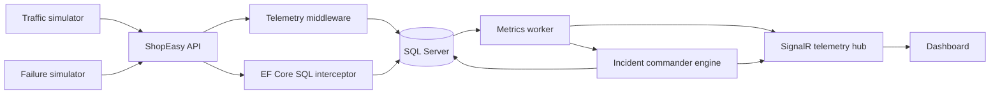

# IncidentIQ System Design

## Purpose

IncidentIQ monitors the small ShopEasy e-commerce API, detects abnormal behaviour, determines the most likely root cause, and presents an explainable incident report in real time. The project is intentionally self-contained so its normal and failed states can be reproduced during a demo.

## Architecture



The system uses Clean Architecture. Dependency direction always points inward: Web API and Infrastructure depend on Application and Domain; Domain has no dependency on the other layers.

| Layer | Project | Responsibility |
|---|---|---|
| Domain | `IncidentIQ.Domain` | Entities, incident enums, domain relationships |
| Application | `IncidentIQ.Application` | DTOs, simulator/RCA contracts, anomaly and RCA use cases |
| Infrastructure | `IncidentIQ.Infrastructure` | EF Core, telemetry middleware, SQL interceptor, workers, simulator implementations |
| Presentation/API | `IncidentIQ.WebApi` | REST controllers, SignalR hub, runtime configuration and dashboard host |

## Runtime workflow

1. A real or simulated user calls a ShopEasy endpoint.
2. `TelemetryCollectorMiddleware` records the HTTP method, path, status, duration and errors.
3. `EfQueryInterceptor` records database-command duration and applies a controlled delay only when a database failure is active.
4. `SystemMetricsWorker` persists a one-second metrics snapshot and publishes `MetricsUpdated`.
5. The anomaly engine evaluates the latest telemetry window against its baseline.
6. When a threshold is breached, the RCA engine uses event order to select a likely cause, evidence and recommended action.
7. The incident and its evidence are stored, then `IncidentDetected` is broadcast through SignalR.

## API and real-time contracts

| Area | Route/event | Purpose |
|---|---|---|
| ShopEasy | `POST /api/auth/login` | Demo authentication |
| ShopEasy | `GET /api/products`, `GET /api/products/{id}` | Catalogue browsing |
| ShopEasy | `POST /api/orders`, `GET /api/orders/{id}` | Order creation and lookup |
| ShopEasy | `POST /api/payments` | Payment processing; API-failure injection target |
| Simulation | `POST /api/simulation/traffic` | Set simulated traffic mode |
| Simulation | `POST /api/simulation/failure` | Activate/reset a failure scenario |
| Incidents | `GET /api/incidents`, `GET /api/incidents/{id}` | Incident history and forensic detail |
| SignalR | `MetricsUpdated` | Latest aggregated metric snapshot |
| SignalR | `IncidentDetected` | New incident plus evidence/RCA result |
| SignalR | `StatusChanged` | Overall health transition |

## Failure scenarios

| Scenario | Controlled change | Expected diagnosis |
|---|---|---|
| Database slowdown | Delay database execution | Database query/performance degradation |
| Traffic spike | Raise virtual-user request rate | Traffic overload/resource saturation |
| API failure | Force payment failures | Payment/external API failure |
| Cascading failure | Database delay followed by downstream errors | Database-origin cascading failure |

## Design safeguards

- Telemetry is observational and must not prevent ShopEasy transactions from completing if a telemetry write fails.
- Failure injection is restricted to the simulator service; normal business controllers do not contain fault logic.
- The initial RCA engine is deterministic and explainable: threshold/baseline detection plus time-order correlation. An ML/LLM explanation layer can be added later without replacing persisted evidence.
- SQLite remains the zero-configuration demo provider; SQL Server is enabled by configuration for the intended final database.

## Running the separated system-design foundation

```powershell
dotnet restore .\IncidentIQ.sln
dotnet run --project .\src\IncidentIQ.WebApi
```

Open `http://localhost:<port>/swagger`. The first startup creates/initializes the configured database and seeds demo users/products.
